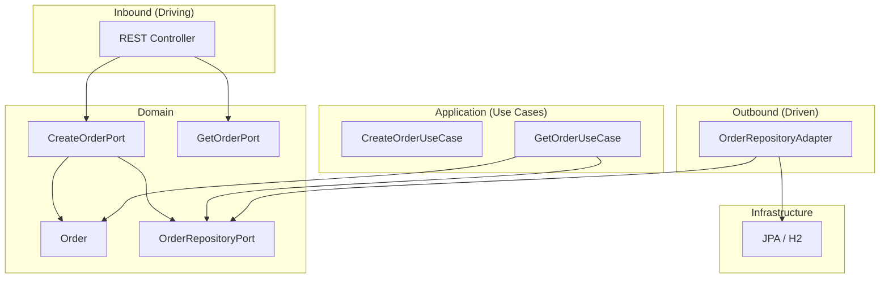

<div align="center">

# Hexagonal (Clean) Architecture Showcase

[](https://openjdk.org/)
[](https://spring.io/projects/spring-boot)
[](https://spring.io/projects/spring-data-jpa)
[](https://www.h2database.com/)
[](https://gradle.org/)
[](https://www.docker.com/)
[](https://junit.org/junit5/)
[](LICENSE)

A **production-style** demo of **Hexagonal (Ports & Adapters)** architecture on the JVM: domain at the centre, use cases in the application layer, and REST + JPA as pluggable adapters. One command to run locally or in Docker.

**[Features](#-features)** • **[Architecture](#-architecture)** • **[Quick Start](#-quick-start)** • **[API](#-api)**

</div>

---

## ✨ Features

| Feature | Description |
|--------|-------------|
| **Hexagonal boundaries** | Domain and ports only; no framework dependencies in the core. Use cases depend on interfaces, not implementations. |
| **Inbound ports** | `CreateOrderPort`, `GetOrderPort` — use case contracts called by the REST adapter. |
| **Outbound port** | `OrderRepositoryPort` — persistence contract implemented by the JPA adapter. |
| **REST adapter** | Controller maps HTTP to port calls and domain models to DTOs; no business logic. |
| **Persistence adapter** | JPA entity and repository; mapping between domain `Order` and `OrderEntity` in one place. |
| **Testability** | Unit tests for use cases with mocked ports; `@WebMvcTest` for the controller; integration test for the repository adapter. |
| **Docker** | Multi-stage Dockerfile (Gradle build, JRE Alpine run); run the app with a single command. |
| **Actuator** | Health and info endpoints for monitoring and container orchestration. |

---

## 🏗 Architecture



**Flow:** HTTP request → **REST adapter** (inbound) → **use case** (implements inbound port) → **domain** + **outbound port** → **persistence adapter** (implements port) → database. Dependencies point inward; the domain does not depend on Spring or JPA.

---

## 📦 Tech Stack

| Layer | Technology |
|-------|------------|
| **Language** | Java 21 |
| **Framework** | Spring Boot 3.2 (Web, Data JPA, Actuator) |
| **Persistence** | Spring Data JPA, H2 (in-memory; replace with PostgreSQL for production) |
| **Build** | Gradle 8.5 (Kotlin DSL) |
| **Tests** | JUnit 5, Mockito, MockMvc, Spring Boot Test |
| **Container** | Docker (multi-stage; Eclipse Temurin JDK/JRE) |

---

## 🚀 Quick Start

### Prerequisites

- **JDK 21** (for local run and tests)
- **Docker** (optional; for containerized run)

### Run locally

```bash
git clone https://github.com/YOUR_USERNAME/hexagonal-clean-architecture.git
cd hexagonal-clean-architecture
./gradlew bootRun
```

- **API:** http://localhost:8080/api/orders  
- **Health:** http://localhost:8080/actuator/health  

### Run with Docker (one command)

```bash
docker build -t hexagonal-clean-architecture . && docker run -p 8080:8080 hexagonal-clean-architecture
```

Then open http://localhost:8080/api/orders and http://localhost:8080/actuator/health .

### Run tests

```bash
./gradlew test
```

---

## 📡 API

| Method | Path | Description |
|--------|------|-------------|
| `POST` | `/api/orders` | Create an order. Body: `{"productIds":["p1","p2"],"amount":2}`. Returns 201 and the created order. |
| `GET` | `/api/orders/{id}` | Get an order by ID. Returns 200 with the order or 404 if not found. |
| `GET` | `/actuator/health` | Health check (e.g. for Docker or Kubernetes). |
| `GET` | `/actuator/info` | Application info (if configured). |

**Example: create and fetch an order**

```bash
# Create
curl -s -X POST http://localhost:8080/api/orders \
  -H "Content-Type: application/json" \
  -d '{"productIds":["p1","p2"],"amount":2}'

# Get (use the orderId from the response)
curl -s http://localhost:8080/api/orders/{orderId}
```

---

## 📁 Project structure

```
hexagonal-clean-architecture/
├── src/main/java/.../hexagonal/
│   ├── HexagonalApplication.java
│   ├── domain/                    # Core: no framework deps
│   │   ├── Order.java
│   │   └── port/
│   │       ├── CreateOrderPort.java
│   │       ├── GetOrderPort.java
│   │       └── OrderRepositoryPort.java
│   ├── application/               # Use cases (implement inbound ports)
│   │   ├── CreateOrderUseCase.java
│   │   └── GetOrderUseCase.java
│   └── adapter/
│       ├── inbound/rest/          # REST API → ports
│       │   ├── OrderController.java
│       │   └── dto/
│       └── outbound/persistence/  # Port implementation → JPA
│           ├── OrderEntity.java
│           ├── OrderJpaRepository.java
│           └── OrderRepositoryAdapter.java
├── src/test/                      # Unit + WebMvc + integration tests
├── Dockerfile
├── build.gradle.kts
├── LICENSE
└── README.md
```

---

## 📄 License

This project is licensed under the [MIT License](LICENSE).
